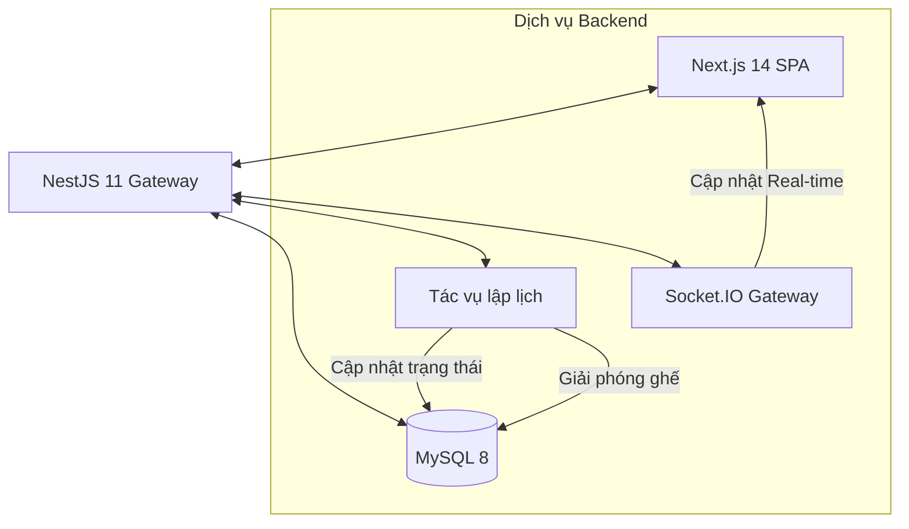
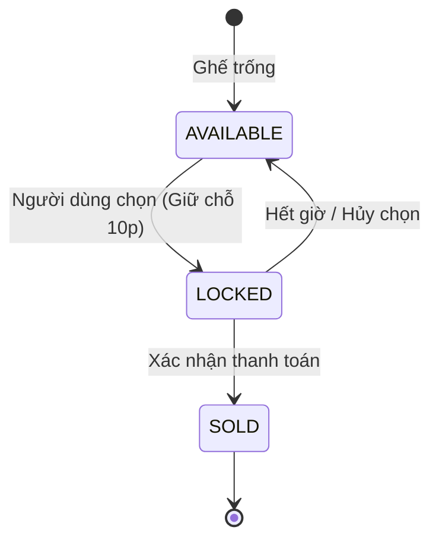

# 🎫 TicketRush

Nền tảng đặt vé trực tuyến hiệu năng cao (High-concurrency), hỗ trợ bản đồ ghế ngồi thời gian thực, cơ chế khóa (Pessimistic Locking) và hệ thống quản lý vòng đời sự kiện tự động.


---

## 🚀 Tính năng cốt lõi

*   **Đồng bộ thời gian thực**: Cập nhật tức thì trạng thái ghế (Trống/Đang giữ/Đã bán) qua WebSocket (Socket.io).
*   **Pessimistic Locking**: Ngăn chặn tình trạng đặt trùng ghế bằng cơ chế `SELECT ... FOR UPDATE` ở mức cơ sở dữ liệu.
*   **Countdown Timer**: Hệ thống đếm ngược 10 phút tích hợp tại bản đồ ghế và trang thanh toán để đảm bảo tính thời sự của phiên giữ chỗ.
*   **Global Checkout Reminder**: Thông báo nhắc nhở thông minh trên Thanh điều hướng (Navbar) giúp người dùng dễ dàng quay lại hoàn tất thanh toán.
*   **Tự động hóa hệ thống**: Sử dụng Cron Jobs để tự động giải phóng ghế hết hạn và chuyển đổi trạng thái sự kiện theo thời gian thực.
*   **Quản trị sự kiện nâng cao**: Admin có khả năng chỉnh sửa thông tin sự kiện linh hoạt và theo dõi doanh thu qua Dashboard 2.0.

---

## 📐 Kiến trúc hệ thống



---

## 🛠️ Công nghệ sử dụng

- **Frontend**: Next.js 14 (App Router), Material UI v5, Zustand, SWR.
- **Backend**: NestJS 11, Prisma ORM, JWT Authentication.
- **Database**: MySQL 8 (Sử dụng InnoDB để đảm bảo tính toàn vẹn giao dịch).
- **Giao tiếp**: REST API & WebSocket (Socket.io).

---

## 💻 Hướng dẫn cài đặt

### 1. Cấu hình Backend
```bash
cd backend
npm install
# Cấu hình DATABASE_URL trong file .env
npx prisma db push
npx prisma db seed
npm run dev
```

### 2. Cấu hình Frontend
```bash
cd frontend
npm install
npm run dev
```

### Tài khoản Demo
| Vai trò | Email | Mật khẩu |
|---|---|---|
| **Quản trị viên** | `admin@ticketrush.io` | `Password123` |
| **Khách hàng** | `user@ticketrush.io` | `Password123` |

---

## 🔒 Xử lý tranh chấp & Quản lý trạng thái

### Vòng đời của Ghế (Seat Lifecycle)


### Ngăn chặn Race Condition
Hệ thống áp dụng cơ chế **Pessimistic Locking** để xử lý hàng ngàn yêu cầu cùng lúc:
1. **Transaction Isolation**: Đảm bảo tính nguyên tử (Atomicity) cho mỗi giao dịch đặt vé.
2. **Database Locks**: Sử dụng khóa mức dòng (Row-level locks) để ngăn chặn việc ghi đè trạng thái.
3. **Double-Validation**: Kiểm tra tính khả dụng của ghế một lần nữa ngay trong transaction trước khi thực hiện ghi dữ liệu cuối cùng.
