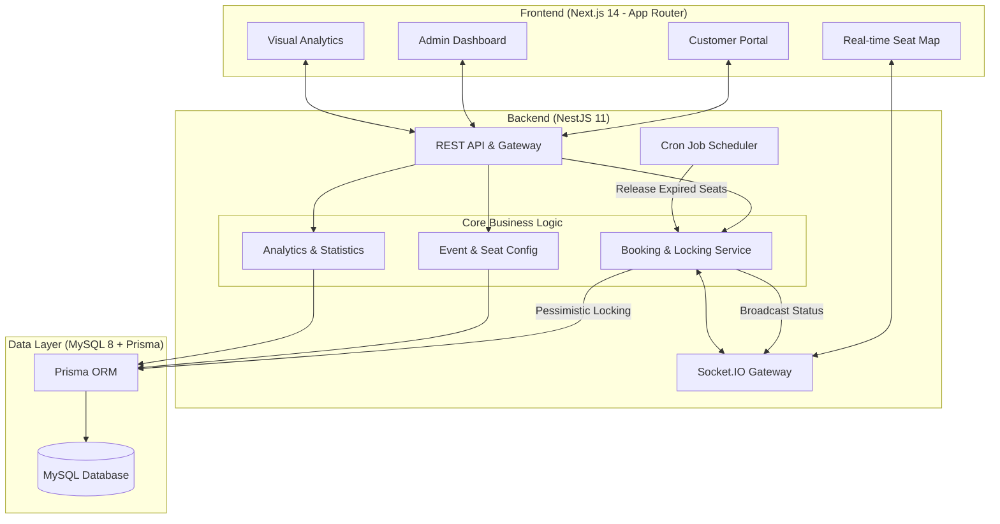
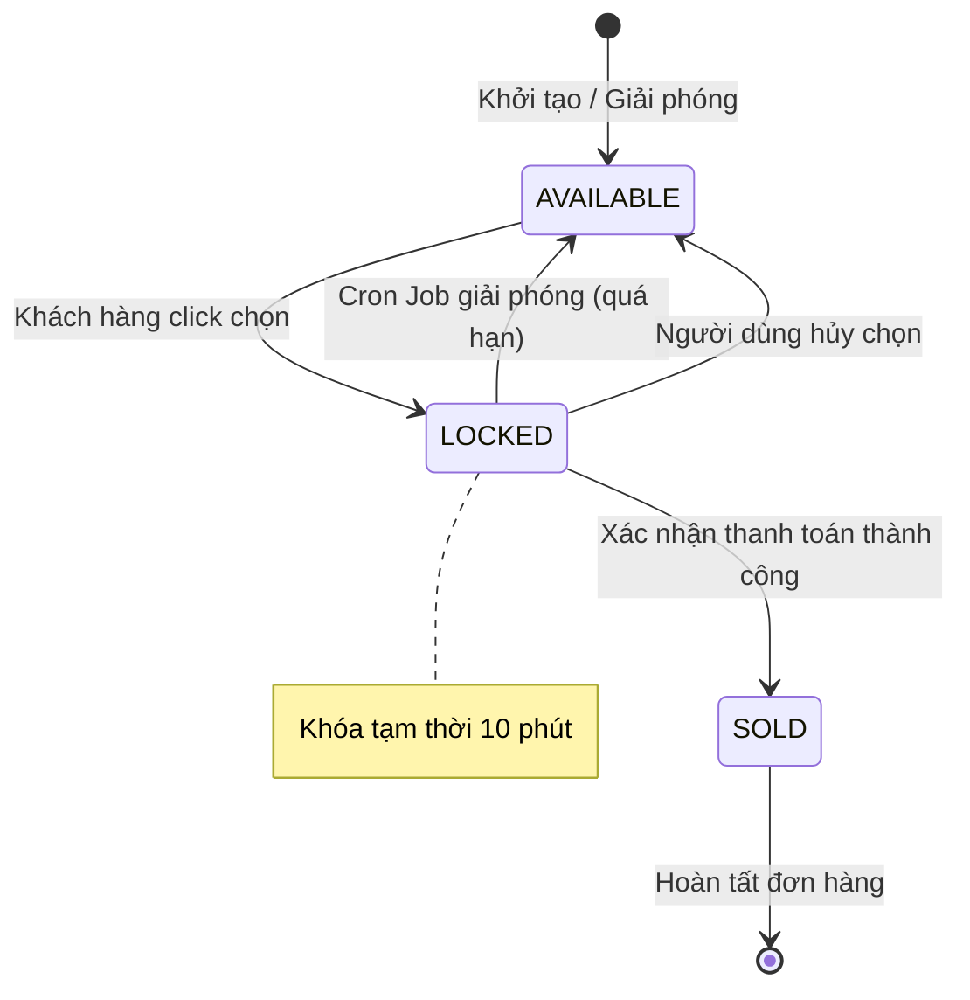

# 🎫 TicketRush

Nền tảng đặt vé trực tuyến hiệu năng cao (High-concurrency), hỗ trợ bản đồ ghế ngồi thời gian thực, cơ chế khóa (Pessimistic Locking) và hệ thống quản lý vòng đời sự kiện tự động.


---

## 🚀 Tính năng cốt lõi

*   **Đồng bộ thời gian thực**: Cập nhật tức thì trạng thái ghế (Trống/Đang giữ/Đã bán) qua WebSocket (Socket.io).
*   **Pessimistic Locking**: Ngăn chặn tình trạng đặt trùng ghế bằng cơ chế `SELECT ... FOR UPDATE` ở mức cơ sở dữ liệu.
*   **Countdown Timer**: Hệ thống đếm ngược 10 phút tích hợp tại bản đồ ghế và trang thanh toán để đảm bảo tính thời sự của phiên giữ chỗ.
*   **Global Checkout Reminder**: Thông báo nhắc nhở thông minh trên Thanh điều hướng (Navbar) giúp người dùng dễ dàng quay lại hoàn tất thanh toán.
*   **Tự động hóa hệ thống**: Sử dụng Cron Jobs để tự động giải phóng ghế hết hạn và chuyển đổi trạng thái sự kiện theo thời gian thực.
*   **Quản trị sự kiện nâng cao**: Admin có khả năng chỉnh sửa thông tin sự kiện linh hoạt và theo dõi doanh thu qua Dashboard 2.0.

---

## 📐 Kiến trúc hệ thống

Dự án TicketRush được xây dựng theo kiến trúc **Monolith hiện đại** (Modular Monolith) với sự tách biệt rõ ràng giữa các tầng (Layered Architecture) để đảm bảo khả năng mở rộng và xử lý tranh chấp dữ liệu ở mức độ cao.

### Sơ đồ tổng quát


### Chi tiết các thành phần

1.  **Frontend (Next.js 14)**:
    *   **Customer Portal**: Tìm kiếm, xem sự kiện và đặt vé. Tích hợp **Countdown Timer** (10 phút) để quản lý phiên giữ chỗ.
    *   **Real-time Seat Map**: Sử dụng WebSocket để cập nhật trạng thái ghế ngay lập tức mà không cần tải lại trang (F5).
    *   **Admin Dashboard**: Quản lý toàn diện sự kiện, sơ đồ ghế và theo dõi doanh thu/tỷ lệ lấp đầy qua biểu đồ trực quan.

2.  **Backend (NestJS 11)**:
    *   **Pessimistic Locking**: Sử dụng cơ chế `SELECT ... FOR UPDATE` trong Transaction để giải quyết tranh chấp (Race Condition) khi hàng ngàn người cùng đặt một ghế.
    *   **Socket.IO Gateway**: Quản lý các kết nối thời gian thực, đảm bảo tính đồng bộ dữ liệu giữa tất cả các Client.
    *   **Cron Scheduler**: Tác vụ chạy nền tự động quét và giải phóng các ghế `LOCKED` quá 10 phút, đưa chúng về trạng thái `AVAILABLE`.
    *   **Analytics Service**: Xử lý dữ liệu nhân khẩu học (độ tuổi, giới tính) và doanh thu thực tế để phục vụ báo cáo Admin.

3.  **Database (MySQL 8)**:
    *   Sử dụng **InnoDB Engine** để hỗ trợ Row-level Locking và ACID Transactions.
    *   **Prisma ORM**: Đảm bảo Type-safety và tối ưu hóa các câu lệnh truy vấn phức tạp.

---
---

## 🛠️ Công nghệ sử dụng

- **Frontend**: Next.js 14 (App Router), Material UI v5, Zustand, SWR.
- **Backend**: NestJS 11, Prisma ORM, JWT Authentication.
- **Database**: MySQL 8 (Sử dụng InnoDB để đảm bảo tính toàn vẹn giao dịch).
- **Giao tiếp**: REST API & WebSocket (Socket.io).

---

## 💻 Hướng dẫn cài đặt

### 1. Cấu hình Backend
```bash
cd backend
npm install
# Cấu hình DATABASE_URL trong file .env
npx prisma db push
npx prisma db seed
npm run dev
```

### 2. Cấu hình Frontend
```bash
cd frontend
npm install
npm run dev
```

### Tài khoản Demo
| Vai trò | Email | Mật khẩu |
|---|---|---|
| **Quản trị viên** | `admin@ticketrush.io` | `Password123` |
| **Khách hàng** | `user@ticketrush.io` | `Password123` |

---

## 🔒 Cơ chế nghiệp vụ quan trọng

### 1. Vòng đời của Ghế (Seat Lifecycle)
Dựa trên yêu cầu khắt khe về tính nhất quán, mỗi ghế trong hệ thống trải qua các trạng thái sau:



### 2. Ngăn chặn Race Condition (Pessimistic Locking)
Để xử lý hàng ngàn request cùng lúc cho một ghế (Flash Sale), hệ thống áp dụng cơ chế khóa bi quan:
*   **Transaction Isolation**: Sử dụng mức cô lập `Serializable` kết hợp với `SELECT ... FOR UPDATE`.
*   **Atomic Updates**: Việc kiểm tra trạng thái và cập nhật `LOCKED` được thực hiện trong một đơn vị giao dịch duy nhất tại Database.
*   **Double-Check**: Ngay sau khi chiếm hữu khóa dòng, hệ thống kiểm tra lại điều kiện `status = 'AVAILABLE'` trước khi ghi dữ liệu.

### 3. Tự động hóa & Real-time
*   **Cron Job Engine**: Chạy định kỳ mỗi phút để quét các bản ghi `locked_at` cũ hơn 10 phút. Khi giải phóng, hệ thống đồng thời phát tín hiệu `broadcast` qua WebSocket để cập nhật giao diện tất cả người dùng khác.
*   **Socket.IO Rooms**: Phân tách luồng dữ liệu theo `eventId` để tối ưu hóa băng thông, chỉ gửi thông tin cập nhật đến những người dùng đang xem cùng một sự kiện.

### 4. Thống kê & Phân tích (Analytics)
*   **Demographics**: Thu thập và phân tích dữ liệu độ tuổi, giới tính của khán giả để hỗ trợ BTC tối ưu chiến dịch Marketing.
*   **Real-time Revenue**: Dashboard Admin cập nhật doanh thu và tỷ lệ lấp đầy (Fill-rate) theo thời gian thực bằng thư viện `@mui/x-charts`.

---
